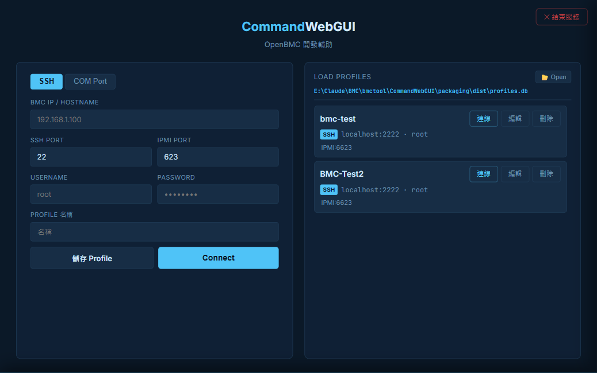

# CommandWebGUI

OpenBMC 韌體開發輔助工具 — 指令面板、終端機、D-Bus 分析

輕量化瀏覽器工具，專為 BMC 韌體開發人員設計。透過 **SSH** 或 **COM Port** 連線至 OpenBMC 目標機，自動偵測可用工具後動態建立指令面板，整合終端機與 D-Bus 分析，無需安裝任何額外軟體。

---

## 介面預覽

### 首頁 — 連線設定與已儲存連線



---

## 功能

| 功能 | 說明 |
|------|------|
| **雙模式連線** | 支援 SSH 與 COM Port（Serial）兩種連線方式 |
| **工具自動探測** | 連線後自動偵測 `obmcutil`、`ipmitool`、`busctl`、`systemctl`、`fw_printenv` 等工具，動態建立對應指令區塊 |
| **指令速查表** | 依類別分組、可搜尋，點擊即執行 |
| **服務管理面板** | 互動式 running services 列表，支援 status / stop / restart / journalctl 一鍵操作 |
| **內建終端機** | 自由輸入指令，↑↓ 鍵瀏覽歷史 |
| **D-Bus 分析** | 瀏覽服務樹、查看物件屬性、即時監看 Signal、下載快照、比對差異 |
| **持久化歷史** | 指令歷史存入 SQLite，重新整理後仍保留 |
| **連線設定檔** | 儲存、編輯、刪除已命名連線；支援匯入／匯出 `.db` 檔案 |
| **ANSI 顏色渲染** | BMC 指令輸出的顏色在瀏覽器中正確顯示 |
| **超長輸出摺疊** | 超過 120 行自動摺疊，點擊可展開 |
| **選用 Basic Auth** | 透過環境變數啟用 Web UI 登入保護 |
| **單例執行** | 重複開啟時自動聚焦現有瀏覽器分頁，不會產生多個 server |
| **系統匣圖示** | 右下角常駐圖示，雙擊開啟瀏覽器，右鍵可結束程序 |
| **單檔打包** | 支援 PyInstaller 打包成單一執行檔，無需安裝 Python |

---

## 環境需求

- Python 3.10+

```
flask>=3.0
paramiko>=3.4
flask-sock>=0.6
pyserial>=3.5     # 選用：COM Port 功能
pystray>=0.19     # 選用：系統匣圖示
pillow>=10.0      # 選用：系統匣圖示
```

```bash
pip install -r requirements.txt
```

> 選用套件未安裝時對應功能自動停用，其他功能不受影響。

---

## 快速啟動

```bash
python src/main.py
```

或執行 `packaging/dist/CommandWebGUI.exe`（無需安裝 Python）。

伺服器自動選取閒置 port 並開啟瀏覽器，網址會印在終端機：

```
[CommandWebGUI] http://localhost:51234
```

---

## 使用方式

### 連線

1. 連線欄選擇 **SSH**（預設）或 **COM Port**
2. SSH：填入 Host（BMC IP）、Port（預設 22）、User、Password
3. COM：從下拉選單選擇 COM Port、Baud Rate（預設 115200）、User、Password
4. 點擊**連線**，工具自動探測可用指令並建立面板

### 指令面板

- **點擊指令列** — 立即透過 SSH／Serial 執行，輸出展開於下方
- 標有 ⚠️ 的指令執行前會顯示確認對話框
- 左側導覽列可快速跳至各指令區塊
- 搜尋框支援即時過濾所有指令

### 終端機

- 點擊右上角 **⚡ 終端機** 開啟底部面板
- 自由輸入指令後按 Enter 或點**執行**
- **↑ / ↓** 鍵瀏覽歷史指令

### D-Bus 分析

連線成功後點擊頂部 **D-Bus 分析** 分頁：

- **服務樹**（左側）— 列出所有 D-Bus 服務，點擊展開物件路徑
- **屬性面板**（右側）— 點選路徑後顯示所有 interface、method、property；property 值即時透過 Signal 自動更新
- **Signal 面板**（下方）— 即時串流 `busctl monitor` 輸出，可依路徑過濾或用 Payload regex 篩選
- **Snapshot** — 下載當前選取服務的全部 property 快照（JSON）
- **Diff** — 比對兩個快照，列出差異 property

> 重新連線 BMC 時，D-Bus 狀態（服務列表、Signal 串流）會自動重置。

### 連線設定檔

- 連線成功後點擊 **💾 儲存連線**，輸入名稱存檔
- 首頁卡片顯示已儲存的連線，點擊 **▶ 連線** 直接重連
- 支援編輯（✏️）、刪除（🗑）
- **📂 開啟舊檔** — 從 `.db` 匯入連線（合併，不覆蓋現有）
- **💾 另存新檔** — 匯出所有連線為 `.db` 供備份或分享

### 關閉應用程式

| 方式 | 操作 |
|------|------|
| **UI 關閉按鈕** | 點擊頁面右上角 **✕ 關閉** |
| **系統匣右鍵** | 右下角圖示右鍵 → **結束** |
| **Console Ctrl+C** | 在終端機按 Ctrl+C |

---

## 選用：Basic Auth 登入保護

```powershell
# Windows PowerShell
$env:WEBGUI_USER = "admin"
$env:WEBGUI_PASS = "secret"
python main.py
```

```bash
# Linux / macOS
WEBGUI_USER=admin WEBGUI_PASS=secret python main.py
```

---

## 自訂指令表

指令定義在 `src/static/commands.json`：

```json
{
  "section": "System",
  "requires": "systemctl",
  "cmds": [
    {
      "label": "列出所有服務",
      "cmd": "systemctl list-units --type=service --no-pager",
      "desc": "顯示所有 systemd service"
    },
    {
      "label": "重啟 BMC",
      "cmd": "reboot",
      "warn": true,
      "warnReason": "這會重啟 BMC，確認要執行嗎？"
    }
  ]
}
```

`requires` 指定的工具未偵測到時，整個區塊自動隱藏。

---

## PyInstaller 單檔打包

```bash
pip install pyinstaller
```

使用專案內建的 `.spec`（推薦）：

```bash
pyinstaller packaging/CommandWebGUI.spec --distpath packaging/dist --workpath packaging/build
```

或手動指定（Windows）：

```
pyinstaller --onefile --noconsole --name CommandWebGUI --add-data "src/templates;templates" --add-data "src/static;static" --hidden-import "pystray._win32" --hidden-import "PIL._imagingtk" src/main.py
```

產生的 `packaging/dist/CommandWebGUI.exe` 可直接發佈，`commandwebgui.lock` 會建立於 EXE 同目錄。

> **連線設定檔路徑（EXE 模式）**：可透過環境變數指定 `profiles.db` 存放位置：
> ```powershell
> $env:PROFILE_DB = "C:\MyTools\profiles.db"
> .\CommandWebGUI.exe
> ```

---

## 支援的 BMC 目標環境

| 環境 | SSH | Serial | 備註 |
|------|-----|--------|------|
| OpenBMC（Yocto） | ✅ | ✅ | 完整功能支援 |
| AMI MegaRAC | ✅ | ✅ | `obmcutil` 區塊自動隱藏 |
| BusyBox-only | ✅ | ✅ | 僅顯示基本指令區塊 |
| AST2700 / AST2600 | ✅ | ✅ | 於 ASPEED EVB 驗證 |
| QEMU 模擬 | ✅ | — | 透過 QEMU port forwarding SSH 連線 |

---

## 安全注意事項

- 密碼以**明文儲存**於 `profiles.db`，本工具定位為本機開發工具，若需對外開放請啟用 Basic Auth。
- Basic Auth 使用 Base64 傳輸（非加密），共用網路上建議透過 SSH tunnel 或 VPN 存取。

---

## 授權

MIT
