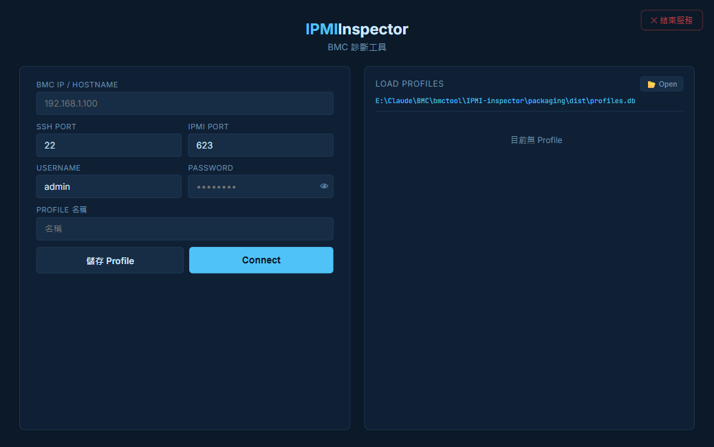
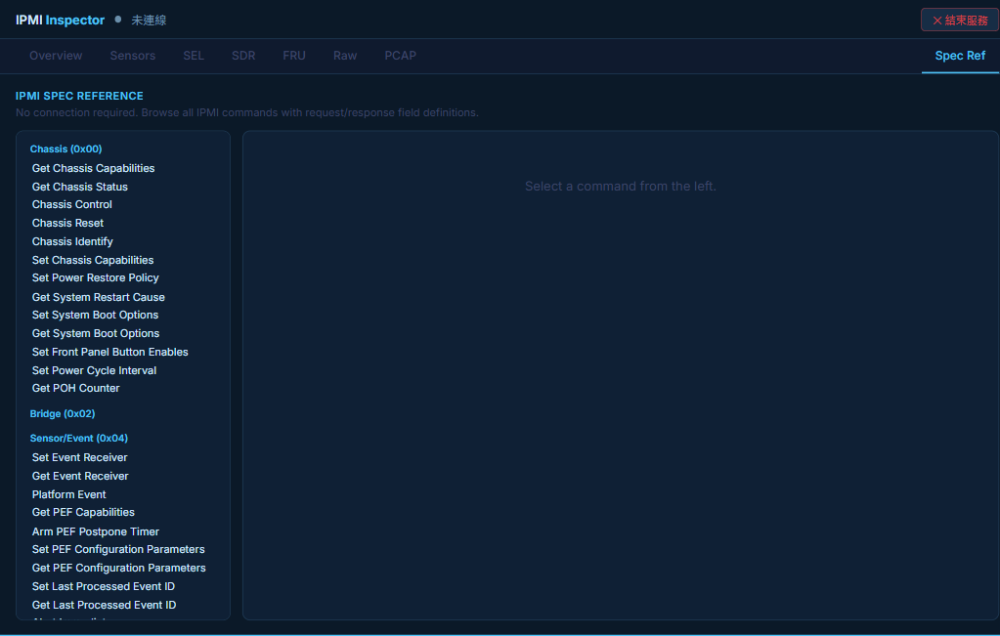

# IPMI-inspector

IPMI / BMC 深度診斷工具 — 連線診斷、離線解碼、Spec 查詢

Web 介面設計，供韌體 RD 使用。支援 IPMI over LAN 即時診斷、SEL / SDR / FRU / PCAP 離線解碼，以及完整 IPMI Spec 速查。

---

## 介面預覽

### 首頁 — 連線設定與已儲存連線



### Spec Ref — IPMI 指令速查（不需連線）



---

## 功能

| 功能 | 說明 |
|------|------|
| **即時 Sensors** | 連線後自動抓取 SDR、串流 Sensor 數值與狀態 |
| **SEL 解析** | 讀取事件紀錄，解析 Generator ID、Sensor Type、事件描述 |
| **SDR Browser** | 完整 SDR 類型解析（Full / Compact / FRU / MCID…） |
| **FRU Decoder** | 解析板卡 FRU 資訊（Chassis / Board / Product / MultiRecord） |
| **Raw Command** | 直接輸入 NetFn / CMD / Data，顯示原始回應並對照 Spec |
| **PCAP 分析** | 上傳 `.pcap` / `.pcapng`，離線解碼 RMCP+ 封包 |
| **Spec Ref** | 完整 IPMI Spec 指令瀏覽（NetFn 分組），含 Request / Response 欄位定義 |
| **連線設定檔** | 儲存、編輯、刪除 BMC 連線；支援匯入／匯出 `.db` |
| **單例執行** | 重複開啟時自動聚焦現有瀏覽器分頁 |
| **系統匣圖示** | 右下角常駐圖示，雙擊開啟，右鍵結束 |

---

## 環境需求

- Python 3.10+

```
flask>=3.0
pyghmi>=1.5.0    # IPMI over LAN (RMCP+)
scapy>=2.5.0     # PCAP 解析
PyYAML>=6.0
rich>=13.0.0
pystray>=0.19    # 選用：系統匣圖示
pillow>=10.0     # 選用：系統匣圖示
```

```bash
pip install -r requirements.txt
```

---

## 快速啟動

```bash
python src/main.py
```

或下載 `packaging/dist/IPMIInspector.exe` 直接執行（無需安裝 Python）。

伺服器自動選取閒置 port 並開啟瀏覽器：

```
[IPMI Inspector] http://localhost:XXXXX
```

---

## 使用方式

### 連線

1. 輸入 BMC IP / Hostname、IPMI Port（預設 623）、Username、Password
2. 點擊 **Connect**，連線成功後跳轉至 Overview 頁面

### 各功能頁

| 頁面 | 說明 |
|------|------|
| **Overview** | BMC Device ID、Firmware Version、IPMI Version 等基本資訊 |
| **Sensors** | 完整 Sensor 列表，含數值、單位、上下限、狀態 |
| **SEL** | 讀取 System Event Log，解析事件描述；Export JSON |
| **SDR** | 完整 SDR Repository 解析 |
| **FRU** | 讀取並解析 FRU 資訊 |
| **Raw** | 自由輸入 IPMI 原始指令（NetFn + CMD + Data） |
| **PCAP** | 上傳 pcap 檔進行離線 RMCP 封包解碼 |
| **Spec Ref** | 無需連線，可獨立使用。依 NetFn 分類瀏覽所有 IPMI 指令定義 |

### Spec Ref 右側面板

各頁面資料列點擊後，右側 Spec 面板自動展開對應的指令定義，顯示 Request / Response 欄位解析。

### 連線設定檔

- 連線成功後點擊 **💾 儲存 Profile**，輸入名稱存檔
- 首頁卡片顯示已儲存的連線，點擊 **▶ 連線** 直接重連
- **📂 開啟舊檔** — 從 `.db` 匯入連線（合併，不覆蓋現有）
- **💾 另存新檔** — 匯出所有連線為 `.db`

### 關閉應用程式

| 方式 | 操作 |
|------|------|
| **UI 關閉按鈕** | 點擊頁面右上角 **✕ 結束服務** |
| **系統匣右鍵** | 右下角圖示右鍵 → **結束** |
| **Console Ctrl+C** | 在終端機按 Ctrl+C |

---

## 專案結構

```
IPMI-inspector/
├── README.md
├── requirements.txt
├── packaging/dist/          # Windows 執行檔（IPMIInspector.exe）
├── docs/                    # 截圖、說明文件
└── src/
    ├── main.py              # 入口：port 管理、系統匣、啟動 Flask
    ├── blueprint.py         # IPMI Flask Blueprint（所有 HTTP routes）
    ├── spec/                # IPMI spec 常數（NetFn、CC、Sensor Type、SDR…）
    ├── decoders/            # 純函式解碼器（SEL、SDR、FRU、PCAP、Message）
    ├── transport/           # BMC 連線（pyghmi wrapper + 連線池）
    ├── storage/             # SQLite schema、感測器趨勢記錄
    └── web/
        ├── app.py           # Flask app 初始化
        ├── templates/       # HTML 模板
        └── static/          # CSS、JS
```

---

## 安全注意事項

- 密碼以**明文儲存**於 `profiles.db`，本工具定位為本機開發工具。
