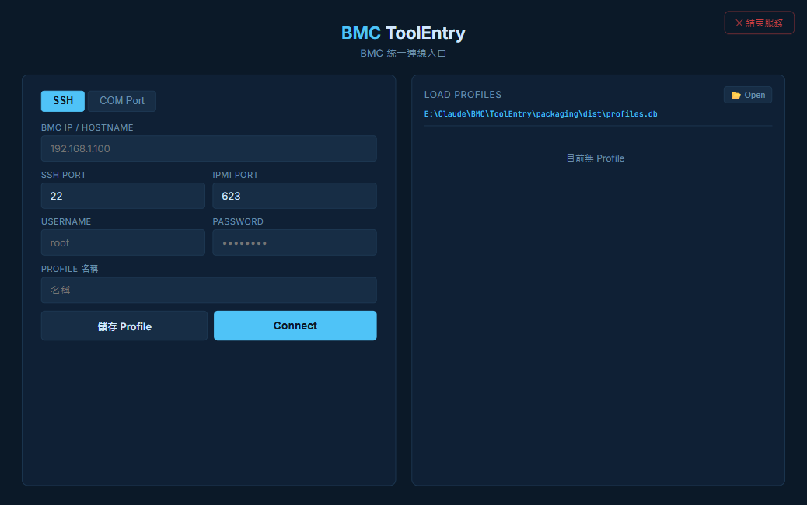
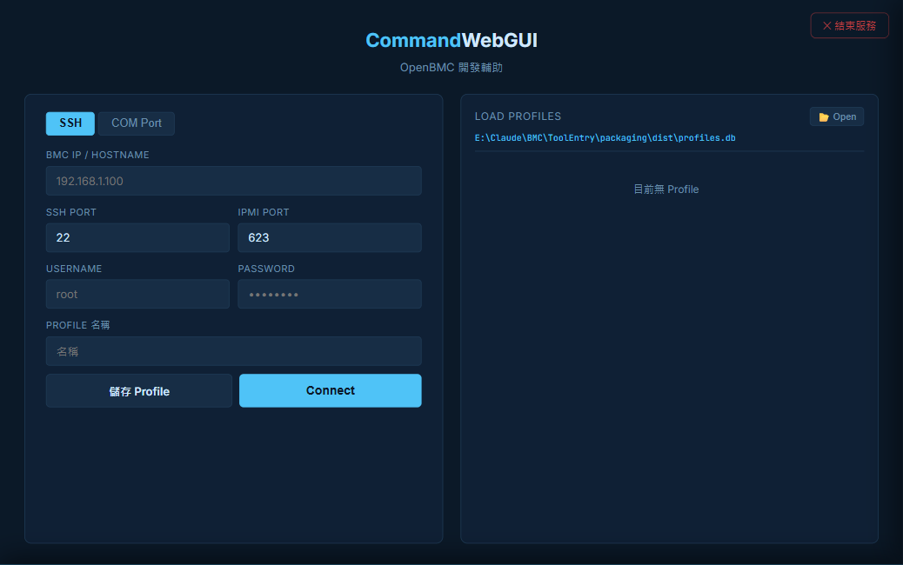
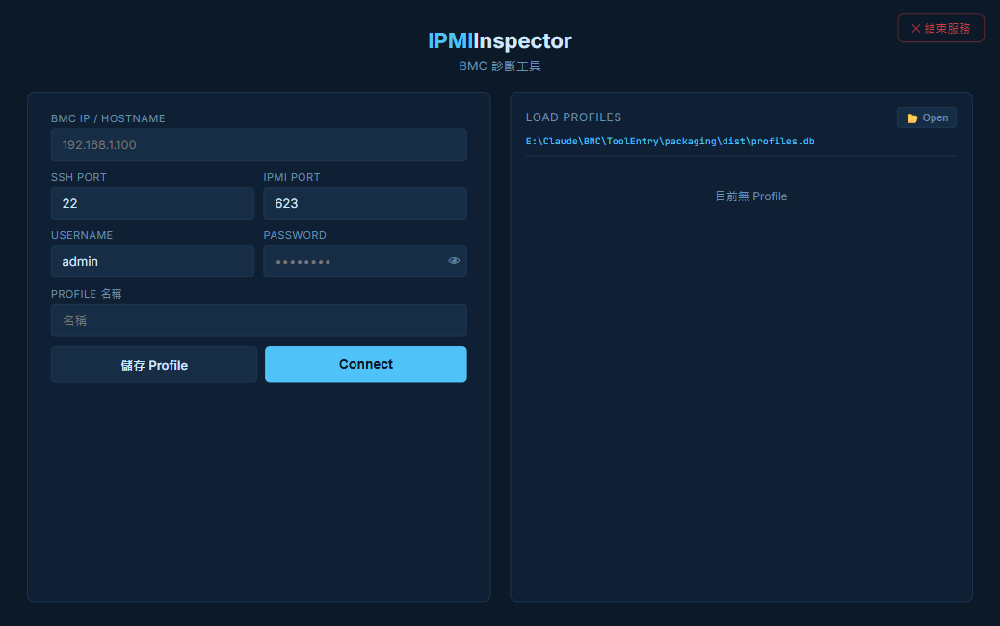

# BMC ToolEntry

BMC 工具統一入口 — 以單一 port 整合多個 BMC 開發工具

連線一次，即可切換使用各子工具，連線設定檔在所有工具間共用。

---

## 介面預覽

### Hub — 連線入口



### CommandWebGUI（/cwg/）



### IPMI Inspector（/ipmi/）



---

## 功能

| 功能 | 說明 |
|------|------|
| **統一入口** | 單一 port、單一連線，各子工具掛載於獨立 URL prefix |
| **Hub 首頁** | 連線設定與已儲存 Profile，連線後選擇工具 |
| **共用 Profiles** | 所有子工具共用同一個 `profiles.db`，連線設定不需重複輸入 |
| **Shell Bar** | 連線成功後子工具頁面顯示統一的連線資訊列 |
| **單例執行** | 重複開啟時自動聚焦現有瀏覽器分頁 |
| **系統匣圖示** | 右下角常駐圖示，雙擊開啟，右鍵結束 |

---

## 環境需求

- Python 3.10+

```
flask>=3.0
flask-sock>=0.7
paramiko>=3.0     # SSH 連線
pyghmi>=1.5       # IPMI over LAN
pyserial>=3.5     # 選用：COM Port
scapy>=2.5        # PCAP 解析
pystray>=0.19     # 選用：系統匣圖示
pillow>=10.0      # 選用：系統匣圖示
```

```bash
pip install -r requirements.txt
```

> 子工具目錄需與 ToolEntry 同層：`CommandWebGUI/`、`IPMI-inspector/`。

---

## 快速啟動

```bash
python src/main.py
```

或執行 `packaging/dist/BMCToolEntry.exe`（無需安裝 Python；已內嵌 CWG 與 IPMI Inspector）。

伺服器預設嘗試 port 7000（被佔用則自動換），開啟瀏覽器後顯示：

```
[ToolEntry] http://localhost:7000
  Hub            → http://localhost:7000/
  CommandWebGUI  → http://localhost:7000/cwg/
  IPMI Inspector → http://localhost:7000/ipmi/
```

---

## 使用方式

### 連線

1. 首頁（`/`）選擇 **SSH** 或 **COM Port**
2. 填入 Host、Port、Username、Password
3. 點擊 **Connect**，SSH 測試通過後進入 Dashboard

### Dashboard

連線成功後顯示工具選擇頁，點擊卡片即可進入對應子工具。

### 子工具頁面

在 CWG 或 IPMI Inspector 頁面頂端會顯示 Shell Bar，顯示當前連線的工具名稱、連線類型、BMC 位址，可從此列返回 Dashboard 或結束服務。

### 關閉應用程式

| 方式 | 操作 |
|------|------|
| **UI 結束按鈕** | 任意頁面右上角 **✕ 結束服務** |
| **系統匣右鍵** | 右下角圖示右鍵 → **結束** |
| **Console Ctrl+C** | 在終端機按 Ctrl+C |

---

## 與子工具獨立版的差異

各子工具皆可獨立執行，也可透過 ToolEntry 整合使用：

| | 獨立執行 | 透過 ToolEntry |
|---|---|---|
| 連線入口 | 各自的 connect 頁面 | ToolEntry Hub（`/`） |
| URL prefix | `/`（根路徑） | 各自獨立 prefix |
| Shell Bar | 不顯示 | 顯示（標示工具名稱與連線資訊） |
| Port | 各自獨立 port | 共用一個 port |

---

## 專案結構

```
ToolEntry/
├── README.md
├── requirements.txt
├── profiles.db              # 共用連線設定檔（自動建立）
├── toolentry.lock           # 單例鎖定（自動建立）
└── src/
    ├── main.py              # 入口：動態載入子工具 blueprint、port 管理、系統匣
    └── hub/
        ├── __init__.py      # Hub blueprint（首頁、連線、Dashboard、favicon）
        ├── templates/       # login.html、dashboard.html
        └── static/          # hub.css、favicon.ico
```

---

## 安全注意事項

- 密碼以**明文儲存**於 `profiles.db`，本工具定位為本機開發工具。
- Secret key 預設為固定值，對外部網路開放時請透過 `SECRET_KEY` 環境變數覆蓋。
